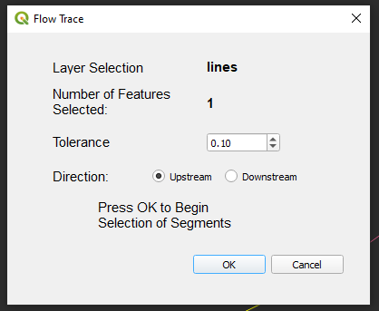
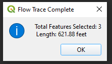

Flow Trace Plugin for Qgis 

This Plugin will select all upstream or downstream polyline segments starting from a selected line segment. The only data you need to supply is a layer with polyline segments and a selected feature from the layer. If no segments are selected then you have connectivity issues with your data.  It will select line segments based on the the digitized direction which is assumed to be upstream to downstream.  The result of the plugin will give you the total distance of the selected line segments.

